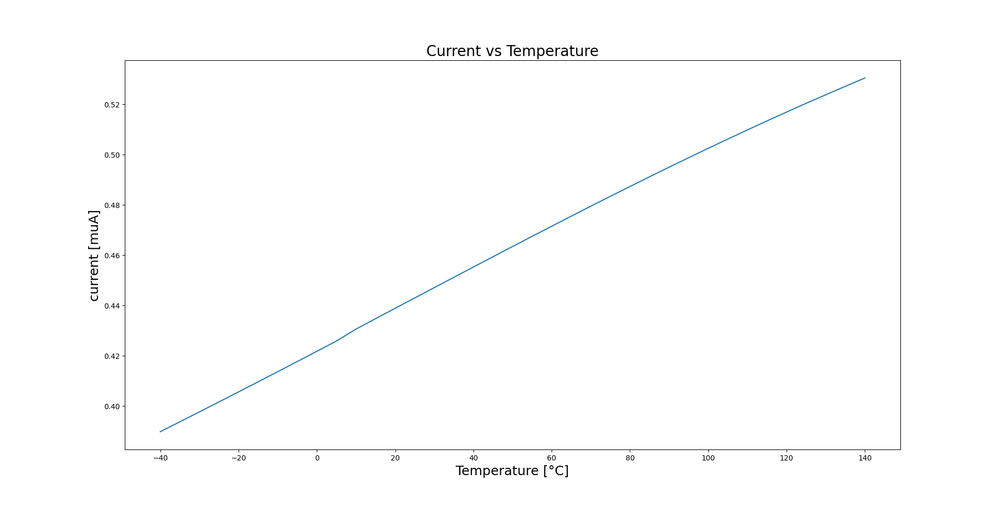
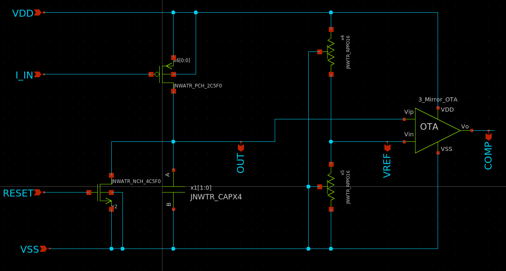

# Who
Trygve
Remi
Toushif

# Why
Temperature sensor based on Vgs characteristic of MosFET working as a diode.
Multiples conversions (Temperature to current then current to time and finally 8 bits digital output) 

# How
The all circuit is divide in 3 sub circuits.
## Sub circuit 1 : Conversion from temperature to current

|  |
| :-: |
| *Schematic of the sub circuit 1, to convert temperature into current* |

In this sub circuit we use the semiconductor physics to made the conversion between temperature
(outside factor) to a current. The goal of this subcircuit is to have an output current proportionnal to temperature. \
We will use the diode characteristic which is different depending on the temperature to make this conversion, our diodes are made by short-circuited the drain-gate of MOSFETs. \
The problem is this relation is not linear but exponential. \
So to solve this problem, we will use a second diode. By substracting the 2 voltages, we will end up with a voltage which varies linearly with Temperature, by adding a resistor we can tranform this voltage difference into a current, our output current. \
By adding a current mirror we can generate the two currents which will go flow trough the 2 diodes. \
The difficult part is to build a OP-AMP with good stability and a DC gain high enough to replicate one of the voltage create by the diode to the other branch of the circuit.

|  |
| :-: |
| *Typical characterisitc of out conversion from temperature to current* |

We see that the characteristic is almost linear. With this variation in current depending to the temperature we can after charge faste or slower a capacitor to convert this current into time, which can increase the value to measure (here just few uA).\

|  |
| :-: |
| *Characteristic current vs temperature for all the corners* |

## Sub circuit 2 : Conversion from current to time

|  |
| :-: |
| *Schematic of the sub circuit 2, conversion from current to time* |

This conversion is mainly based on the charging time of a capacitor. With the constant current provide by the first sub-circuit the capacitor will charge linearly with respect to time. \
With the fact that the output current is proportionnal to temperature. The slope of the voltage versus time during charging time is proportionnal to the temperature. \
So,now we will compare this output voltage to a reference voltage. We measure the rising time from 0V to the voltage reference. This period of time will be proportional to temperature. \
We have a transistor which is use as a swith to reset to 0V the capacitor when it is charged. \
To compare the 2 signals (capacitor output voltage and reference voltage), we use the same OP-AMP describe in the first sub-circuit, but working in comparison mode.

|  |
| :-: |
| *Capacitor output voltage for different temperature (-25 50 100) with holding reset until 1 us* |

Now, we see that the capacitor is charging linearly and the slope is changing with the temperature (related to current, sub-circuit 1). \ 
By comparing this signal with a constant signal, we can generate a period which is proportional to temperature. \
Note : The voltage reference is now just a voltage divider made with resistance, it's ok to do this because the input current into the OP-AMP is really small so will don't have a huge voltage drop. Voltage reference will be change a bit with a temperature variation (due to resistance) but it is really small (less than a mV by simulation) so this difference in voltage reference will change so little the time period that the digital conversion will earase this disfunctionnality. Futhermore, we don't have the time to build a better voltage reference and we prefer to concentrate in other part of the circuit like digital conversion and increase sensibility.
 
## Sub circuit 3 : Digital conversion and control

|  |
| :-: |
| *Schematic of the sub circuit 3, digital part* |

The last step is to convert this analog period of time value into a digital value coded with 8 bits. \
To do that, we have built an 8 bits asynchronous counter. It will count how many clock cycle passed during the time period and by knowing the period of a clock cycle we can compute the real period to charge the capacitor and at the and the temperature value. \
The 8 bits counter is build with 8 D flip-flops with falling edge and reset. \
It's asynchronous because only the first flip flop is driven by the clock signal, the others flip flops are driven by the output of the previous flip flop. \
We have had also D latch at the output of each bit signal of the counter to be able to save the last temperature measurment, so we can continuously measure the temperature and increamenting the counter. \
With this we can saved the last measured value and the user can read the value later even if a new measurement is running (counter -> output bit changing with counting process). \
With this the user don't need to be synchronize with the sensor to get the accurate value of the temperature. \
At the end, we need to control, with logical gate, reset period, saving data period and measuring period. \
So when the value of the comparator is "1" (capacitor voltage higher than reference voltage, ) we need to :

- stop the clock, to fix the digital output value to the right value
We need to achieve this truth table

| OUT_COMPA | CLK | CLK_COUNT   |
| :-        | :-: | :-:         |
| 0         | 0   | 0           |
| 0         | 1   | 1           |
| 1         | 0   | 1 (no edge) |
| 1         | 1   | 1 (no edge) |

So we need a NOR gate

- then save the 8 bits values into the D latches.
We connect the output bit signal of the counter to the D input and the enable signal of the latch is the output of the comparator. \

| OUT_COMPA | Bx_OUTCOUNT | Bx_LATCH  |
| :-        | :-:         | :-:       |
| 0         | X           | Latched   |
| 1         | 0           | 0 (saved) |
| 1         | 1           | 1 (saved) | 

- then we can reset the counter, the capacitor and resart the main clock to resart counting and measuring
To do this we have add a supplementary 2 bit counter to delay the time when the output signal of the comparator reach "1" and when we need to reset the counter. This is important because the saving process of the 8 bits into D latch is slower than the process to reset the counter and we want to save the value measured not the reseted value.\
(during reset of capacitor voltage will drop to 0V so the comparator value will be "0") \

|  |
| :-: |
| *Simulation for the all digital sub-circuit with counter, latches and reset function* |

We can see  in the first graph, the output signal of the comparator which as almost a reset function \
The second graph is the clock signal. \
The third graph show when the auxialiar counter reach his maximal value and we can reset the main counter because measured value is stored \
In the forth and fifth is the B0 and B1 just at the output of the counter. We see that counter is working well by incrementing value. \
In the sixth graph, we can see the B2 signal at the output of his D latch. We see that the value is well store at the end of the auxiliary counter (value saved to make user reading easy). \

# What

| What            |        Cell/Name |
| :-              |  :-:       |
| Schematic       | design/JNW_GR03_SKY130A/TB_JNW_GR03_ANALOG.sch |
| Layout          | design/JNW_GR03_SKY130A/TB_JNW_GR03_ANALOG.mag |

# Changelog/Plan

| Version | Status | Comment|
| :---| :---| :---|
|0.1.0 | ok | Provide temperature value but still not really linear and not enough sensible |

# Signal interface

| Signal       | Direction | Domain  | Description                               |
| :---         | :---:     | :---:   | :---                                      |
| VDD          | Input     | VDD     | Main supply                               |
| VSS          | Input     | Ground  |                                           |
| PWRUP        | Input     | VDD     | Power up the circuit                      |
| B0           | Output    | Digital | B0 of the 8bits measure                   |
| B1           | Output    | Digital | B1 of the 8bits measure                   |
| B2           | Output    | Digital | B2 of the 8bits measure                   |
| B3           | Output    | Digital | B3 of the 8bits measure                   |
| B4           | Output    | Digital | B4 of the 8bits measure                   |
| B5           | Output    | Digital | B5 of the 8bits measure                   |
| B6           | Output    | Digital | B6 of the 8bits measure                   |
| B7           | Output    | Digital | B7 of the 8bits measure                   | 

# Key parameters

| Parameter                             | Min     | Typ             | Max     | Unit  |
| :---                                  | :---:   | :---:           | :---:   | :---: |
| Technology                            |         | Skywater 130 nm |         |       |
| AVDD                                  | 1.7     | 1.8             | 1.9     | V     |
| Temperature                           | -40     | 27              | 125     | C     |
| VHL (highest voltage for "0" digital) |         | 0.3*VDD         |         | V     |
| VLH (lowest voltage for "1" digital)  |         | 0.7*VDD         |         | V     |

