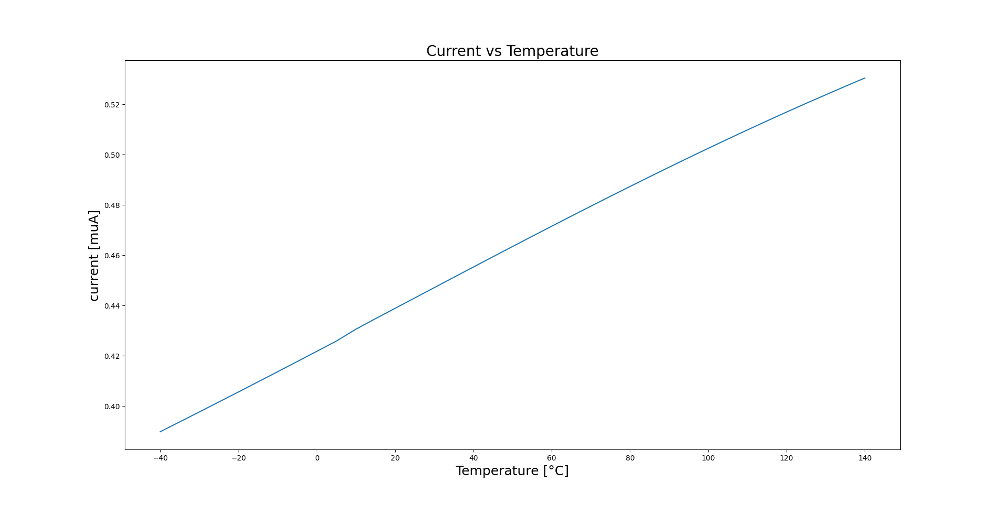

In this sub circuit we use the semiconductor physics to made the conversion between temperature
(outside factor) to a current. The goal of this subcircuit is to have an output current proportionnal to temperature. \
We will use the diode characteristic which is different depending on the temperature to make this conversion, our diodes are made by short-circuited the drain-gate of MOSFETs. \
The problem is this relation is not linear but exponential. \
So to solve this problem, we will use a second diode. By substracting the 2 voltages, we will end up with a voltage which varies semilinearly with Temperature, by adding a resistor we can tranform this voltage difference into a current, our output current. \
By adding a current mirror we can generate the two currents which will go flow trough the 2 diodes. \
The difficult part is to build a OP-AMP with good stability and a DC gain high enough to replicate one of the voltage create by the diode to the other branch of the circuit.

|  |
| :-: |
| *Typical characterisitc of out conversion from temperature to current* |

We see that the characteristic is almost linear. With this variation in current depending to the temperature we can after charge faste or slower a capacitor to convert this current into time, which can increase the value to measure (here just few uA).
